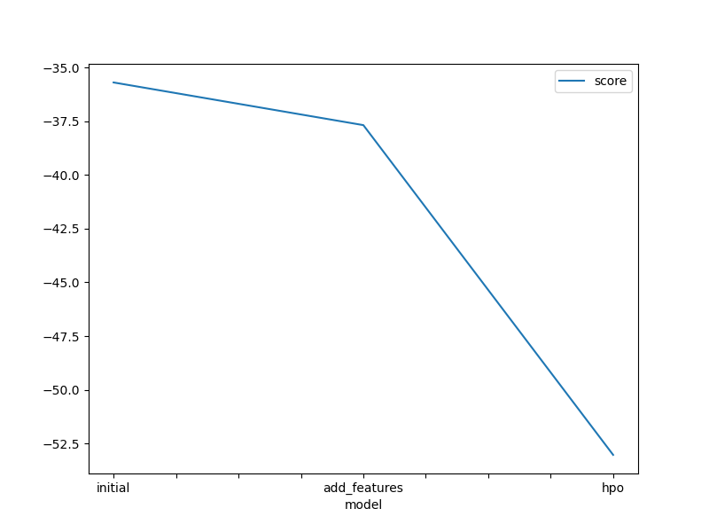
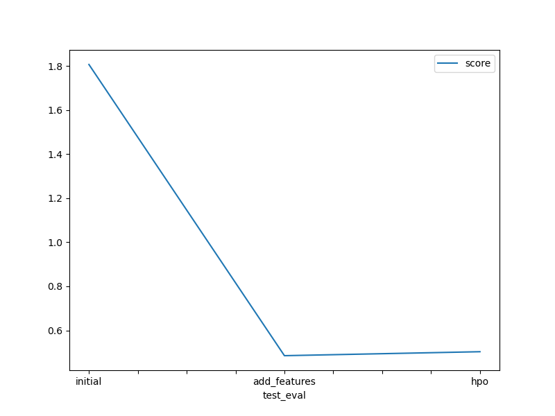

# Report: Predict Bike Sharing Demand with AutoGluon Solution
#### NIDHI IYER

## Initial Training
### What did you realize when you tried to submit your predictions? What changes were needed to the output of the predictor to submit your results?
I realised the possibilty of getting negetive values and the importance of converting those negetive values to zero.

### What was the top ranked model that performed?
WeightedEnsemble_L3 was the top ranked model.

## Exploratory data analysis and feature creation
### What did the exploratory analysis find and how did you add additional features?
Initially the distribution wasn't clear. To solve this I added new columns for year, month and day by using the dt or the datetime accessor in pandas.

### How much better did your model preform after adding additional features and why do you think that is?
My score went from 1.80663 to 0.48535 showing quite an improvement. I think this is because after adding separate columns the model was able to optimize a more varied dataset.

## Hyper parameter tuning
### How much better did your model preform after trying different hyper parameters?
My Kaggle score went from 0.48535 to 0.50336. I have tried adjusting the number of trials, the search strategy (using a random search), and setting the overall hyperparameter configuration to "light" (potentially less complex models), I achieved a small improvement in Kaggle score. This suggests that even with limited training time, fine-tuning hyperparameters, including exploring a random search approach which might be well-suited for this specific problem, can lead to better model performance.

### If you were given more time with this dataset, where do you think you would spend more time?
Given more time I would have done more feature engineering, EDA and do more error analysis.

### Create a table with the models you ran, the hyperparameters modified, and the kaggle score.
| Model        | Searcher | Num Trials | Hyperparameters | Score   |
|--------------|----------|------------|-----------------|---------|
| initial      | default  | default    | default         | 1.80663 |
| add_features | default  | default    | default         | 0.48535 |
| hpo          | random   | 5          | light           | 0.50336 |

### Create a line plot showing the top model score for the three (or more) training runs during the project.

### Create a line plot showing the top kaggle score for the three (or more) prediction submissions during the project.

## Summary
I learned about the potential issues with having negative values, the impact of creating a more diverse dataset, and how optimizing certain parameters affected the performance of the model.
